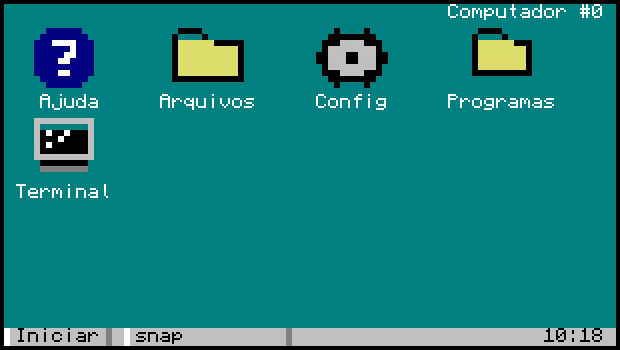
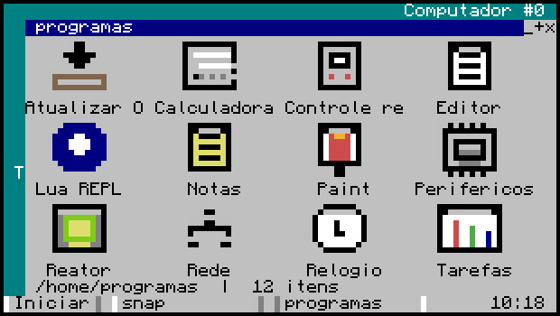
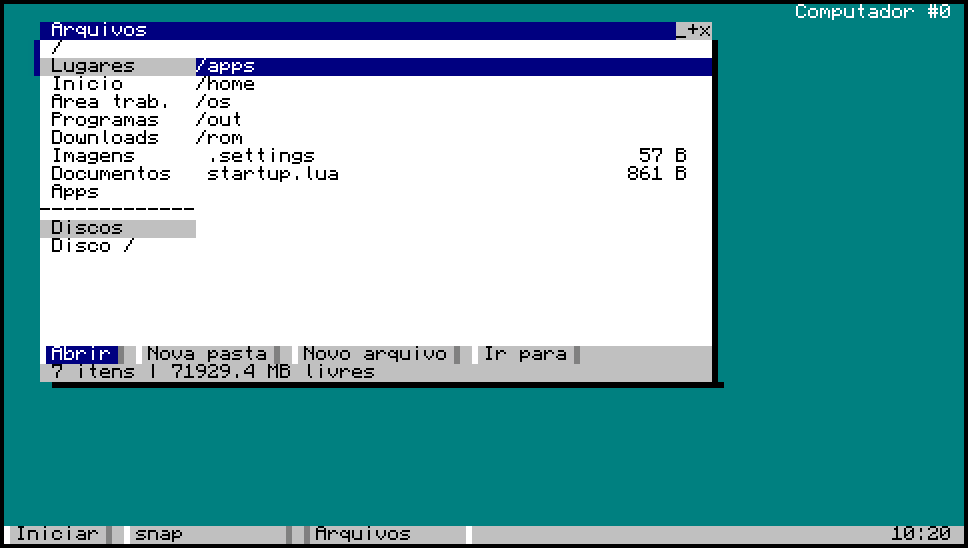
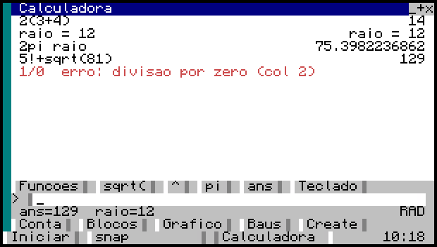
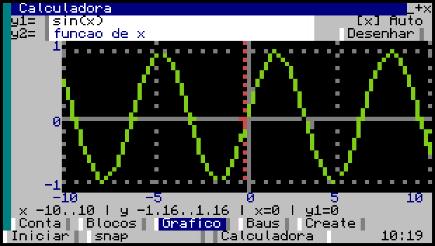
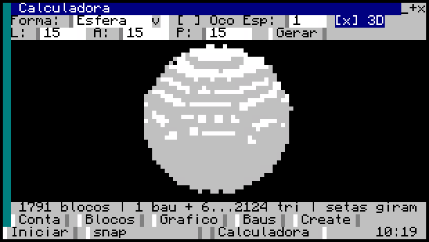
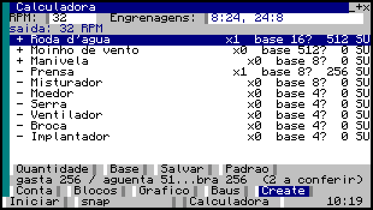
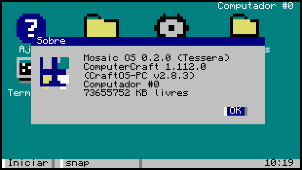

# Mosaic OS

Sistema operacional com janelas para [CC:Tweaked](https://tweaked.cc), escrito em Lua 5.1 puro —
sem Basalt, sem Pine3D, sem nenhuma dependência externa. Alvo: **Minecraft 1.16.5 / All The Mods 6**
(CC:Tweaked ~1.95–1.101, Advanced Peripherals 0.7.x).




## Estado do projeto

**Tudo que está aqui foi desenvolvido e testado no [CraftOS-PC](https://www.craftos-pc.cc/), não
dentro do Minecraft.** O CraftOS-PC é a implementação real do CC:Tweaked fora do jogo — ROM, shell,
`edit`, `paint` e a API `window` de verdade — então ele pega bug de integração que um emulador
caseiro não pegaria. Mas ele não é o jogo.

O que isso significa na prática:

- **Pode haver problema dentro do Minecraft que aqui não aparece.** O computador do jogo é mais
  lento, roda Cobalt em vez do Lua do CraftOS-PC, e divide tempo com o servidor.
- **O CraftOS-PC 2.8+ traz uma ROM mais nova que a da 1.16.5** (Lua 5.2, CC:T 1.109+). Ele não
  acusa uso de API nova demais — quem cuida disso é o `tools/lint.js`, que é a autoridade sobre
  compatibilidade com o alvo.
- **Periférico não dá para testar aqui.** Drive de disquete, chat box, player detector, ME bridge e
  reator do Powah só se provam no jogo. O código deles existe e tem guarda contra ausência, mas
  "não quebra sem o periférico" é diferente de "funciona com ele".

Nada disso é motivo para não usar — é motivo para reportar. Problema encontrado no jogo vira
correção nas próximas atualizações, e o app **Atualizar OS** existe justamente para isso.

## Instalação

No computador do jogo (precisa ser **advanced computer** para mouse e cores, e a API `http`
tem que estar habilitada no servidor):

```
wget run https://raw.githubusercontent.com/NoobDetonator/mosaic-os/master/install.lua
reboot
```

O instalador guarda o `/startup.lua` que já existia como `/startup.old.lua` antes de sobrescrever.

### Atualizar

Pelo app **Atualizar OS** dentro do sistema, ou de novo pela linha de comando:

```
wget run https://raw.githubusercontent.com/NoobDetonator/mosaic-os/master/install.lua update
```

Ambos comparam arquivo por arquivo e só baixam o que mudou.

### Se algo quebrar

Crie o arquivo `/os/safemode` (`edit /os/safemode`, salve vazio) para o `startup.lua` pular o boot
e te deixar no shell da ROM. Apague o arquivo para voltar ao normal.

## O que vem dentro

### Área de trabalho e arquivos

A área de trabalho **é uma pasta** (`/home/desktop`): o que está lá é o que aparece na tela.
Atalho é um arquivo `.lnk` comum, então criar, renomear e apagar ícone é mexer em arquivo.
Os programas moram na pasta Programas, que abre como janela de ícones.



O gerenciador de arquivos tem barra lateral de Lugares e de Discos, com disquete aparecendo
sozinho quando entra no drive. Recortar, copiar e colar são compartilhados entre janelas.



### Calculadora

Cinco modos. O de contas tem analisador próprio — precedência de verdade, multiplicação implícita
(`2pi raio`), fatorial, graus ou radianos e variáveis — com histórico navegável pela seta para cima
e teclado de botões em F2.



Gráfico de função com eixos, marcações, escala automática, arrastar e aproximar:



Formas em bloco com a contagem e o desenho do que você vai construir — círculo, esfera, cúpula,
cone, losango e mais, cheios ou ocos —, e a pré-visualização em 3D:



E matemática do mod Create. As fórmulas são verdade por construção; os valores por bloco vivem numa
tabela editável e **nascem marcados com `?`** até você conferir no jogo com os Óculos de Engenheiro:



### Kernel

Scheduler de processos em coroutines cooperativas, gerenciador de janelas com z-order,
arrastar/redimensionar e taskbar, e um toolkit de widgets próprio (`form`, `button`, `textbox`,
`list`, `iconview`, `checkbox`, `dropdown`, `group`, `progress`, modais) com layout ancorado e
navegação completa por teclado.

### Bibliotecas

| | |
|---|---|
| `expr` | analisador de expressão (tokenizador + descendente recursivo) |
| `plot` | gráfico de função com eixos e escala |
| `mcmath` | formas em bloco, stacks e recipientes |
| `create` | razão de engrenagem e stress do mod Create |
| `mesh` / `three` | malha 3D, câmera e rasterizador com z-buffer |
| `pixel` | canvas de sub-pixel (2x3 por célula) |
| `vector` | rasterizador de vetor 2D |
| `icons` | ícones `.nfp` de 12x12 |
| `hal` | periféricos, com os nomes do Advanced Peripherals 0.7 |
| `fsx`, `strutil`, `httpx`, `log` | arquivo, texto, HTTP e registro |
| `shortcut`, `clip`, `props`, `fileops` | atalhos, área de transferência e operações de arquivo |
| `chart`, `powah` | série temporal e reator do Powah |

### Rede

`netd` para conversar com outros computadores Mosaic via rednet, e `relay` para se conectar por
websocket a um servidor Node fora do jogo.

**Relay (`relay/`)** — servidor Node opcional que roda no seu PC: dashboard web para ver e controlar
os computadores do jogo, API HTTP, e um servidor MCP (`mcp.js`) para o Claude Code operar o
computador in-game direto.



## Desenvolvimento

```bash
cd tools && npm install     # luaparse + fengari
node tools/lint.js          # sintaxe Lua 5.1 + APIs novas demais para 1.16.5
node tools/test.js          # self-check do kernel no emulador CC embutido
node tools/icons.js         # regenera os icones (arte em texto dentro do script)
node tools/manifest.js      # regenera o manifest.json usado pelo instalador

cd relay && npm install && node relay.js   # http://localhost:8765
node tools/test-relay.js                   # teste de integração do relay
```

Com o [CraftOS-PC](https://www.craftos-pc.cc/) instalado dá para rodar contra a implementação real
do CC, sem abrir janela:

```bash
node tools/craftos.js test          # o mesmo self-check, na ROM verdadeira
node tools/craftos.js boot          # liga o OS e mostra a tela
node tools/craftos.js shot calc     # abre um app pelo registry e fotografa
node tools/craftos.js bench         # mede compositor, ícone, vetor e quadro 3D
```

Os prints deste README saíram todos do `shot`. Ele tem cenários prontos (`programas`, `calc`,
`calc3d`, `calcgraf`, `calccreate`, `about`, `startctx`) que clicam e digitam antes da foto —
print de tela vazia não prova nada.

As regras de código (o que é proibido usar por causa do Lua 5.1 e do CC:T antigo) e as armadilhas
já encontradas estão em [CLAUDE.md](CLAUDE.md) — vale a leitura antes de mandar PR.

## Estrutura

```
startup.lua          entrada, fica na raiz do computador
install.lua          instalador/atualizador
manifest.json        lista de arquivos + hashes (gerado)
os/boot.lua          inicializa settings, wm, kernel e daemons
os/kernel/           proc (scheduler), wm (janelas), ui (widgets), draw, theme, palette
os/lib/              bibliotecas (ver a tabela acima)
os/net/              relay (websocket), netd (rednet)
os/apps/             aplicativos
os/docs/             manual lido pelo app Ajuda dentro do sistema
os/share/            ícones .nfp e desenhos vetoriais
relay/               servidor Node + dashboard + MCP
tools/               lint, emulador, testes, bench, gerador de manifest
docs/img/            prints usados neste README
```

## Manual

O manual completo está em [`os/docs/`](os/docs) e é lido pelo app **Ajuda** dentro do sistema:

1. [Primeiros passos](os/docs/01-primeiros-passos.md)
2. [Os aplicativos](os/docs/02-aplicativos.md)
3. [Rede e relay](os/docs/03-rede-e-relay.md)
4. [Seus programas](os/docs/04-seus-programas.md)
5. [Arquivos e atalhos](os/docs/05-arquivos-e-atalhos.md)
6. [Calculadora](os/docs/06-calculadora.md)
7. [Estado e limites](os/docs/07-estado-e-limites.md)

## Licença

[MIT](LICENSE).
