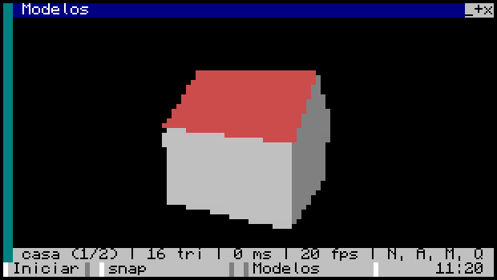
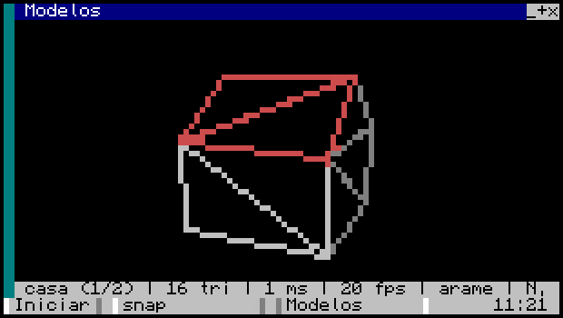
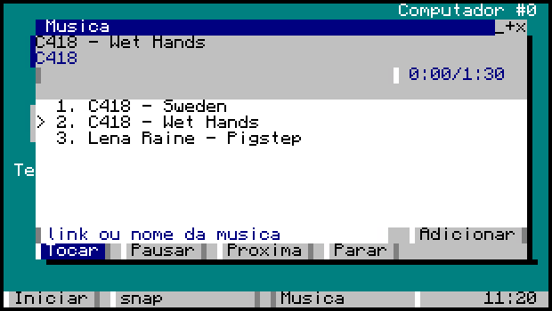
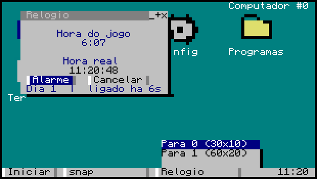
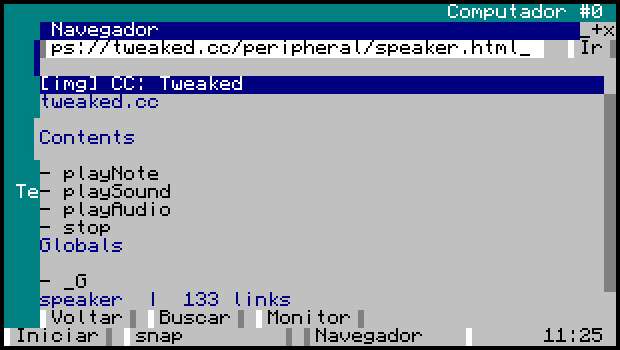
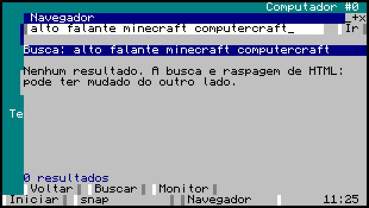
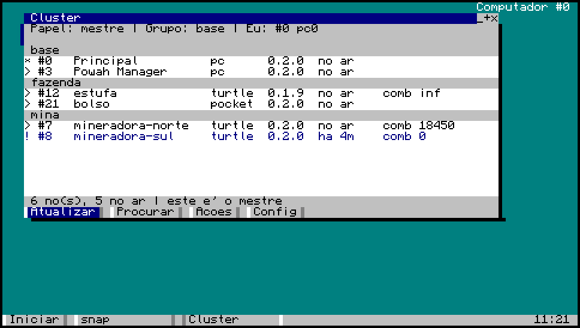
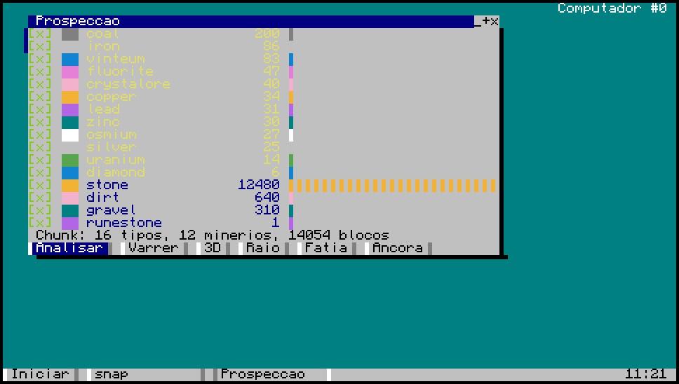

# Mosaic OS

A windowed operating system for [CC:Tweaked](https://tweaked.cc), written in plain Lua 5.1 — no
Basalt, no Pine3D, no external dependencies at all. Target: **Minecraft 1.16.5 / All The Mods 6**
(CC:Tweaked ~1.95–1.101, Advanced Peripherals 0.7.x).


> The system's interface and its built-in manual are in **Brazilian Portuguese**. This README and
> everything under [`docs/`](docs) are in English. Code identifiers are English; code comments are
> Portuguese.


## Project status

**Everything here was built and tested in [CraftOS-PC](https://www.craftos-pc.cc/), not inside
Minecraft.** CraftOS-PC is a real CC:Tweaked implementation outside the game — real ROM, shell,
`edit`, `paint` and the real `window` API — so it catches integration bugs a homemade emulator
would miss. But it is not the game.

What that means in practice:

- **There may be problems inside Minecraft that never show up here.** The in-game computer is
  slower, runs Cobalt instead of CraftOS-PC's Lua, and shares time with the server. Measured: the
  3D engine runs **40× slower in-game** than in the benchmark.
- **CraftOS-PC 2.8+ ships a newer ROM than 1.16.5 does** (Lua 5.2, CC:T 1.109+). It will not flag
  the use of too-new APIs — that job belongs to `tools/lint.js`, which is the authority on target
  compatibility.
- **Peripherals cannot be tested here.** Disk drives, chat boxes, player detectors, ME bridges and
  the Powah reactor only prove themselves in-game. Their code exists and guards against absence,
  but "doesn't break without the peripheral" is not the same as "works with it".

None of that is a reason not to use it — it's a reason to report. A problem found in-game becomes a
fix in the next update, which is exactly what the **Atualizar OS** app is for.

## Install

On the in-game computer (it must be an **advanced computer** for mouse and colour, and the `http`
API must be enabled on the server):

```
wget run https://raw.githubusercontent.com/NoobDetonator/mosaic-os/master/install.lua
reboot
```

The installer saves any pre-existing `/startup.lua` as `/startup.old.lua` before overwriting it.

### Updating

Through the **Atualizar OS** app inside the system, or from the command line again:

```
wget run https://raw.githubusercontent.com/NoobDetonator/mosaic-os/master/install.lua update
```

Both compare file by file and download only what changed. Updates are **transactional**: if a write
fails halfway through, the original file comes back.

### If something breaks

Create the file `/os/safemode` (`edit /os/safemode`, save it empty) to make `startup.lua` skip the
boot and drop you in the ROM shell. Delete the file to go back to normal.

## What's inside

### Desktop and files

The desktop **is a folder** (`/home/desktop`): what lives there is what shows on screen. A shortcut
is an ordinary `.lnk` file, so creating, renaming and deleting an icon is just touching files.
Programs live in the Programs folder, which opens as an icon window.


The file manager has a sidebar of Places and Disks, with floppies appearing on their own when
inserted. Cut, copy and paste are shared across windows.


### Calculator

Five modes. The arithmetic mode has its own parser — real precedence, implicit multiplication
(`2pi radius`), factorial, degrees or radians, and variables — with history you can walk with the
up arrow, and a button keypad on F2.


Function plotting with axes, ticks, automatic scaling, panning and zooming:


Block shapes with the count and the drawing of what you're about to build — circle, sphere, dome,
cone, diamond and more, solid or hollow — plus a 3D preview:


And Create mod maths. The formulas are correct by construction; the per-block values live in an
editable table and **start marked with `?`** until you confirm them in-game with the Engineer's
Goggles:


### Kernel

A process scheduler built on cooperative coroutines, a window manager with z-order,
drag/resize and a taskbar, and a widget toolkit of its own (`form`, `button`, `textbox`, `list`,
`iconview`, `checkbox`, `dropdown`, `group`, `progress`, modals) with anchored layout and full
keyboard navigation.

See [docs/architecture.md](docs/architecture.md) for how the pieces fit together.

### Libraries

| | |
|---|---|
| `expr` | expression parser (tokeniser + recursive descent) |
| `plot` | function plotting with axes and scaling |
| `mcmath` | block shapes, stacks and containers |
| `create` | Create mod gear ratios and stress |
| `mesh` / `three` | 3D meshes, camera and a scanline rasteriser with z-buffer |
| `pixel` | sub-pixel canvas (2×3 per cell) |
| `vector` | 2D vector rasteriser |
| `icons` | 12×12 `.nfp` icons |
| `hal` | peripherals, using Advanced Peripherals 0.7 names |
| `netx` / `cluster` | rednet request/reply, roles, groups and the node table |
| `turtlex` | turtle capabilities, movement with a reason, position that survives |
| `geo` / `geo3d` | Geo Scanner readings and the 3D chunk view |
| `update` | SHA-1, transactional install and rollback |
| `audio` | speakers, system sounds and DFPWM streaming |
| `fsx`, `strutil`, `httpx`, `log` | files, text, HTTP and logging |
| `shortcut`, `clip`, `props`, `fileops` | shortcuts, clipboard and file operations |
| `chart`, `powah` | time series and the Powah reactor |

### 3D

An engine of its own: meshes with chainable transforms, file-free generators (cube, plane, grid,
voxels), orbit and free-flight cameras, near-plane clipping, and a scanline rasteriser with a
z-buffer drawing into sub-pixels. Written by studying [Pine3D](https://github.com/Xella37/Pine3D)'s
architecture without depending on it.

**~877k triangles/second in CraftOS-PC — but only ~21k/s in the actual game.** That 40× gap is the
single most important number in this repository: the benchmark runs as a native process on a PC,
not as Cobalt inside a Minecraft server. Every optimisation has a prediction, a measurement and a
verdict in [docs/3d-performance.md](docs/3d-performance.md) — including the predictions of mine
that the measurement refuted.

**Models made in Blender.** `node tools/obj.js model.obj` reads the `.obj` with its `.mtl`
alongside, matches each material's diffuse colour to the Mosaic palette, and writes the mesh into
`os/share/models/`. The file is indexed rather than a flat list of triangles: Suzanne has 507
vertices for 968 triangles, and repeating each vertex six times cost 105 KB on a computer with 1 MB
of disk in total — indexed she takes 33 KB and draws in 3 ms.



**Wireframe mode**, with the line clipped to the rectangle before Bresenham runs — without that
clip, an edge with a vertex just behind the camera projects to millions of points and freezes the
computer on the 7-second abort. Wireframe only reads well with few polygons: at 968 triangles the
edges touch and it turns into a smudge.



**And it leaves the little window:** the viewer throws the same model onto a monitor. Measured in
CraftOS-PC, a 102×38 monitor at scale 0.5 gives 204×114 points and costs 7 ms, against 3 ms for the
window.

Three demos in [`os/demos/`](os/demos): a spinning cube, terrain with a free camera, and the model
viewer. They deliberately do not appear in the Start menu or the Programs folder: open Files, go to
`/os/demos` and choose Run.

### Sound and music

System sounds (open, close, error, boot) and a music player with a queue that accepts a YouTube
link **or just the song's name**. The queue lives in a service, not in the window: closing the
player does not stop the music.

Needs a speaker next to the computer, and the relay running on your PC with `yt-dlp` and `ffmpeg` —
the in-game computer does not download video, it receives already-converted audio chunks.



### Wall screens

Any app can move to a monitor and take the whole wall: right-click its button in the taskbar. One
computer serves several walls, instead of one computer per wall.

The app re-lays itself out for the new size, a touch on the monitor becomes a click, and if someone
breaks the block the app returns to the desktop instead of hanging.



### Browser

Opens web pages inside the game. No images and no JavaScript, but it reads text, follows links and
searches. Links become numbers, like in text browsers: type `7` and Enter.

The relay is what reads the HTML and returns ready-made blocks (and strips accents, or the CC
terminal draws garbage). Without the relay it still opens plain text files.





### Cluster: several computers as one system

A CC computer is small — 1 MB of disk and a time budget the game cuts off at seven seconds.
Changing language does not lift that: the limit belongs to the mod. The way to grow without
depending on anything outside the game is **more computers**.

One of them is the master; the rest are nodes, organised into **groups** (`north-mine`, `farm`) so
one fleet's orders don't land on another. The panel shows type, version, how long ago each one
spoke, and turtle fuel — and **Update** makes a node (or a whole group) match the master, which is
the only one that needs internet.



**Nodes speak first; the master never polls.** That isn't style: when nobody is nearby the chunk
unloads and the computer **does not pause** — it loses everything and returns to an empty shell. A
node that comes back simply resumes its heartbeat. For the same reason the master's table goes to
disk, and a turtle's position is written **on every step**, not at the end of the task.

A turtle is a computer that walks: install Mosaic on it, equip a modem, and it joins the fleet.

Protocol details are in [docs/cluster.md](docs/cluster.md).

### Prospecting

Reads the Geo Scanner and answers three different questions: what exists in the chunk, what exists
within a radius, and **where** — the last one in 3D, with the turtle inside the scene.



A detail that costs time to discover, and is therefore built into the app: **radius up to 8 is
free**, above that the cost explodes — and the scanner starts with zero capacity. The app asks the
scanner how far it can go without power, instead of offering a radius that would fail.

### Networking

`netd` talks to other Mosaic computers over rednet; `relay` connects by websocket to a Node server
outside the game.

**Relay (`relay/`)** — an optional Node server running on your PC: a web dashboard to watch and
control the in-game computers, an HTTP API, the gateway that fetches web pages and converts music,
and an MCP server (`mcp.js`) that lets Claude Code drive the in-game computer directly. See
[relay/README.md](relay/README.md).


## Development

```bash
cd tools && npm install     # luaparse + fengari
node tools/lint.js          # Lua 5.1 syntax + APIs too new for 1.16.5
node tools/test.js          # kernel self-check in the built-in CC emulator
node tools/icons.js         # regenerate the icons (text art lives inside the script)
node tools/manifest.js      # regenerate the manifest.json the installer uses

cd relay && npm install && node relay.js   # http://localhost:8765
node tools/test-relay.js                   # relay integration test
node tools/test-gateway.js                 # HTML→blocks, address filter, audio chunking
```

With [CraftOS-PC](https://www.craftos-pc.cc/) installed you can run against the real CC
implementation without opening a window:

```bash
node tools/craftos.js test          # both suites, on the real ROM
node tools/craftos.js boot          # boot the OS and print the composed screen
node tools/craftos.js shot calc     # open an app through the registry and photograph it
node tools/craftos.js bench         # measure compositor, icons, vectors and a 3D frame
node tools/craftos.js live          # a Mosaic you can actually use: sound, relay, monitors
```

Every screenshot in this README came from `shot`. It has ready-made scenarios that click and type
before taking the picture — a photo of an empty screen proves nothing.

[docs/testing.md](docs/testing.md) explains what each harness catches and, more importantly, what
each one *cannot* catch.

The coding rules (what's forbidden because of Lua 5.1 and old CC:T) and the traps already
discovered live in [CLAUDE.md](CLAUDE.md), in Portuguese — worth reading before opening a PR.

## Layout

```
startup.lua          entry point, lives at the computer's root
install.lua          installer / updater
manifest.json        file list + hashes (generated)
os/boot.lua          brings up settings, wm, kernel and daemons
os/kernel/           proc (scheduler), wm (windows), ui (widgets), draw, theme, palette
os/lib/              libraries (see the table above)
os/net/              relay (websocket), netd (rednet), musicd (music queue)
os/apps/             applications
os/docs/             the manual the Ajuda app reads, in Portuguese
os/share/            .nfp icons, vector drawings and 3D models
relay/               Node server + dashboard + MCP
tools/               lint, emulator, tests, bench, manifest generator
docs/                developer documentation, in English
docs/img/            screenshots used in this README
```

## Documentation

For developers, in English:

- [Architecture](docs/architecture.md) — kernel, compositor, processes, widgets, libraries
- [Testing](docs/testing.md) — the four harnesses and the blind spots of each
- [Cluster](docs/cluster.md) — the rednet protocol, roles, groups and software distribution
- [3D performance](docs/3d-performance.md) — every optimisation with prediction, measurement, verdict
- [Relay](relay/README.md) — the Node server, its HTTP API and the music pipeline

For users, in Portuguese, read inside the system by the **Ajuda** app — [`os/docs/`](os/docs):

1. [Primeiros passos](os/docs/01-primeiros-passos.md)
2. [Os aplicativos](os/docs/02-aplicativos.md)
3. [Rede e relay](os/docs/03-rede-e-relay.md)
4. [Seus programas](os/docs/04-seus-programas.md)
5. [Arquivos e atalhos](os/docs/05-arquivos-e-atalhos.md)
6. [Calculadora](os/docs/06-calculadora.md)
7. [Estado e limites](os/docs/07-estado-e-limites.md)
8. [Três dimensões](os/docs/08-3d.md)
9. [Reator](os/docs/09-reator.md)
10. [Som e música](os/docs/10-som-e-musica.md)
11. [Telas e monitores](os/docs/11-telas-e-monitores.md)
12. [Navegador](os/docs/12-navegador.md)
13. [Cluster](os/docs/13-cluster.md)
14. [Prospecção](os/docs/14-prospeccao.md)

## Licence

[MIT](LICENSE).
